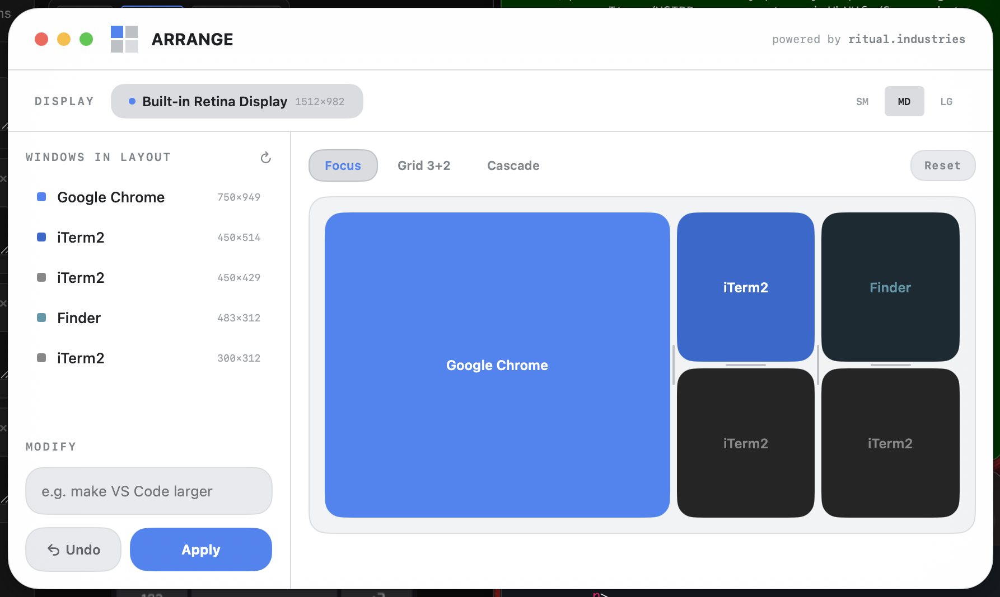

# Arrange

A macOS menu bar utility for arranging windows into layouts — instantly.



## Download

**[Download Arrange.zip](https://github.com/brianharms/arrange-app/releases/latest/download/Arrange.zip)**

Unzip and move `Arrange.app` to your `/Applications` folder.

> **Note:** Arrange is not notarized. On first launch, right-click the app and choose **Open** to bypass Gatekeeper.

## What it does

Arrange detects all open windows on your screen and lets you snap them into clean layouts with one click. Pick a preset (Focus, Grid, Cascade, Trident, and more), drag windows between slots to reassign them, or type a natural language instruction to modify the layout with AI.

- **Layout presets** — Single, Halves, Focus, Stack, Thirds, Sidebar, Grid, Cascade, Cockpit, Trident
- **Drag to reorder** — swap windows between slots in the canvas preview
- **Resize seams** — drag the dividers to adjust column/row proportions live
- **AI modify** — type something like "make Chrome bigger on the left" and it adjusts the layout
- **Undo / Reset** — restore previous window positions at any time
- **Multi-monitor** — select which display to arrange
- **Theme system** — 6 styles, 14 color palettes, 3 fonts, dark/light mode

## Requirements

- macOS 14.0 (Sonoma) or later
- Accessibility permissions (prompted on first launch)

## Usage

1. Launch Arrange — it lives in your menu bar
2. Press **Ctrl + Option + A** to open/close the panel
3. Pick a layout preset from the tabs
4. Hit **Apply** to snap your windows into place

For AI layout modification, go to **Settings** and enter your [Anthropic API key](https://console.anthropic.com/).

## Build from source

Requires [XcodeGen](https://github.com/yonaskolb/XcodeGen).

```bash
brew install xcodegen
make build
make run
```

---

Built by [ritual.industries](https://ritual.industries)
